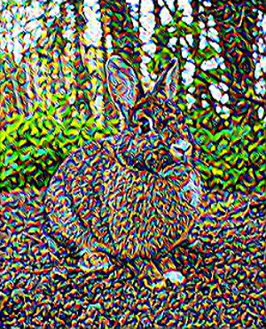
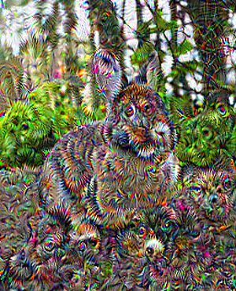
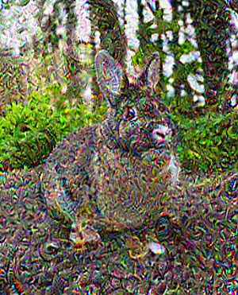

# Deep Dream API

## Intro

This is a Deep Dream implementation using PyTorch with pretrained GoogLeNet weights. The algorithm is very simple (doesn'b't use octaves) and aims to be fast. As of now, in a MBP with an i7 it runs in ~5s. The deployed version in Heroku tends to be slower and is not always available.

Here are some of the available styles:

| Original | Painting |
| --- | --- |
|  |  |
| <center>**Mixed**</center> | <center>**Trippy**</center> |
|  |  |
| <center>**Syd Barret**</center> | <center>**Whatever**</center> |
|  |  |


## API

The only available call for now is: **http://deep-api-23.herokuapp.com/deep/dream/<style>**
where *<style>* is one of:

- painting
- texture
- trippy
- barret
- whatever

No API Key is required.

## Deployment

This API is hosted in [heroku](http://heroku.com). Here is a snippet to quickly try the API using the **trippy** style:

```
curl \
    -X POST \
    -F 'image=@/path/to/source/image.jpeg' \
    http://deep-api-23.herokuapp.com/deep/dream/trippy \
    --output /path/to/output/image.jpeg
```

The Heroku app is linked to this repo to perform continous deployment over the master branch.

#### DISCLAIMER:

Heroku requests have a timeout of 30s. This time should be enough to run the algorithm, but it's not consistent at all! So it won't work every time.

## Requirements

- [Dev Requirements](./support/requirements/dev.txt) can be installed using: `pip install -r ./support/requirements/dev.txt`.
- [Heroku Requirements](./support/requirements/heroku.txt) are prepared to install the CPU-only PyTorch version and will work in Linux only.

## Development Run

### uwsgi

```
uwsgi --ini uwsgi.ini 
```

### development

```
python deep_api
```
